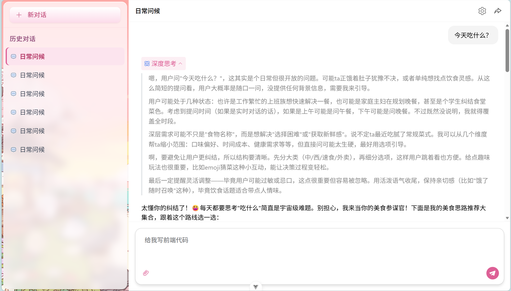
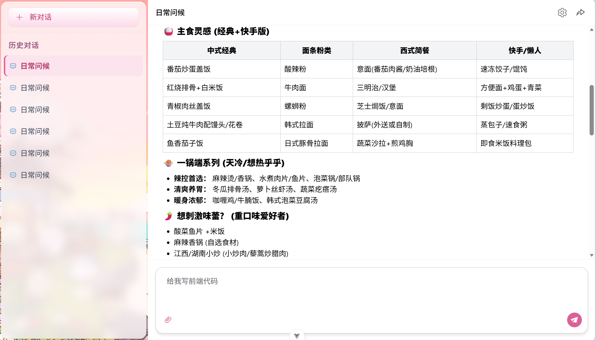

# ChiiChat

基于 **Vue 3** 的对话前端：多会话、流式/非流式回复、Markdown 与代码高亮、附件上传与在线预览（图片 / PDF / 常见 Office 格式）。大模型请求与业务 HTTP 客户端分离，便于对接自有后端。


## 功能

- **对话**：多会话管理，流式输出（ReadableStream / SSE 解析由 `messageHandler` 处理）
- **展示**：markdown-it + highlight.js
- **附件**：拖拽或选择；预览（Office 使用 @vue-office；PDF 走浏览器内置查看器）
- **登录（演示）**：双 Token 流程在前端用 **localStorage 模拟持久化**；`axios` 实例带拦截器，401 时尝试刷新并重试一次
- **主题与设置**：Element Plus + Pinia 持久化





## 技术栈

| 项 | 说明 |
|----|------|
| 运行时 | Vue 3、**TypeScript** |
| 构建 | Vite 6、`vue-tsc` 类型检查 |
| 路由 / 状态 | Vue Router、Pinia + pinia-plugin-persistedstate |
| UI | Element Plus、SCSS |
| 正文 | markdown-it、highlight.js |
| 文档预览 | @vue-office/docx、excel、pptx |
| HTTP（业务侧） | axios（大模型仍使用 `fetch`，见 `src/lib/api.ts`） |

## 目录结构（节选）

```text
src/
├── assets/                 # 静态资源、全局样式、主题变量
├── components/
│   ├── chat/               # 输入区、消息、附件、预览、会话编辑
│   └── SettingsPanel.vue
├── lib/
│   ├── api.ts              # 大模型 chat/completions（fetch）
│   ├── http.ts             # 业务 axios：Bearer、401 刷新重试
│   ├── auth-api.ts         # 登录/刷新（当前为本地 mock，可换真实接口）
│   ├── mock-gateway.ts     # 统一响应信封（便于对齐后端约定）
│   ├── mock-db.ts          # 浏览器内模拟表结构（演示用）
│   ├── messageHandler.ts   # 流式与非流式响应处理
│   └── …
├── stores/                 # chat、setting、auth
├── views/                  # Home、Login、Chat
└── main.ts
```

## 快速开始

```bash
npm install
npm run dev
```

```bash
npm run build
npm run preview
```

复制环境变量示例（可选）：

```bash
cp .env.example .env
```

## 配置说明

1. **大模型**  
   在应用内「设置」中填写 **API Key**、选择模型等。默认请求 SiliconFlow（见 `src/lib/api.ts` 与 `src/stores/setting.ts`）。

2. **业务后端（可选）**  
   - 环境变量 `VITE_APP_API_BASE`：axios 默认 `baseURL`（未设置时为 `/api`）。  
   - 将 `src/lib/auth-api.ts` 中的 `loginApi` / `refreshApi` 改为请求真实登录与刷新接口即可；`mock-gateway.ts` 的 `unwrapGateway` 可继续用于解析 `{ code, msg, data }` 一类响应。  
   - `mock-db.ts` 仅用于演示，接入真实服务后可删除相关引用。

3. **演示登录**  
   任意 **非空用户名 + 非空密码** 即可通过当前 mock。数据保存在浏览器 `localStorage`（键名见 `mock-db.ts`）。

## 脚本

| 命令 | 说明 |
|------|------|
| `npm run dev` | 开发服务器 |
| `npm run build` | 生产构建（含 `vue-tsc` 类型检查） |
| `npm run typecheck` | 仅运行 TypeScript / Vue 类型检查 |
| `npm run preview` | 预览构建产物 |
| `npm run lint` | ESLint |

## 许可证

[MIT](LICENSE)

